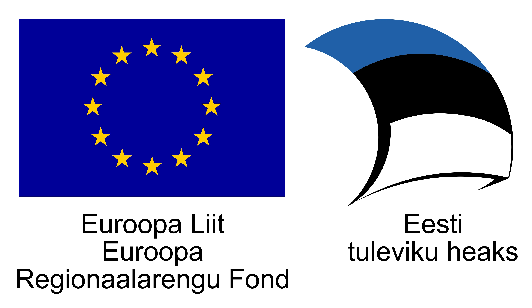

# cdoc4j
Java library for working with CDOC documents.

## Origin
This project started with the help of European Regional Development Fund.



## Features
* Creation of CDOC documents containing encrypted files
* Decryption of files from CDOC documents

## Supported formats
* **CDOC 1.0** - AES-128-CBC, only RSA recipients (deprecated)
* **CDOC 1.1** - AES-256-GCM, RSA and EC recipients **(Recommended)**

## Requirements
* Java 1.7 
* [Unlimited Strength Jurisdiction Policy](https://github.com/open-eid/cdoc4j/wiki/Enabling-Unlimited-Strength-Jurisdiction-Policy)

## How to use it
Take a look at the [examples](https://github.com/open-eid/cdoc4j/wiki/Examples-of-how-to-use-it)

## Maven Central
You can use the library as a dependency from [Maven Central](http://mvnrepository.com/artifact/org.open-eid.cdoc4j/cdoc4j)

```xml
<dependency>
    <groupId>org.open-eid.cdoc4j</groupId>
    <artifactId>cdoc4j</artifactId>
    <version>1.3</version>
</dependency>
```
